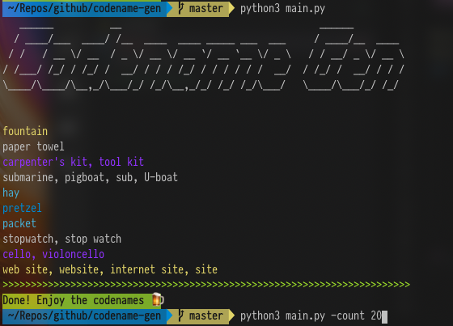

# codename-gen
### A simple codename generator tool, free to use, its just for fun，you can play it all day long, enjoy!

The codename generator is based on the imagenet 1000 classes as the source, to install and enjoy the fun, just simply clone the library: 

`git@github.com:leonli/codename-gen.git`

then 

`pip install -r requirements.txt` 

and 

`python3 main.py --count 20` 

you should be all set.